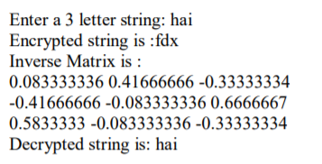

# Program 3

## Aim of the Experiment
Write a Java program to perform encryption and decryption using the following algorithms 

a. Ceaser Cipher

b. Substitution Cipher

c. Hill Cipher

## Output
### Ceaser Cipher Output:

### Hill Cipher Output:

### Substitution Output:

